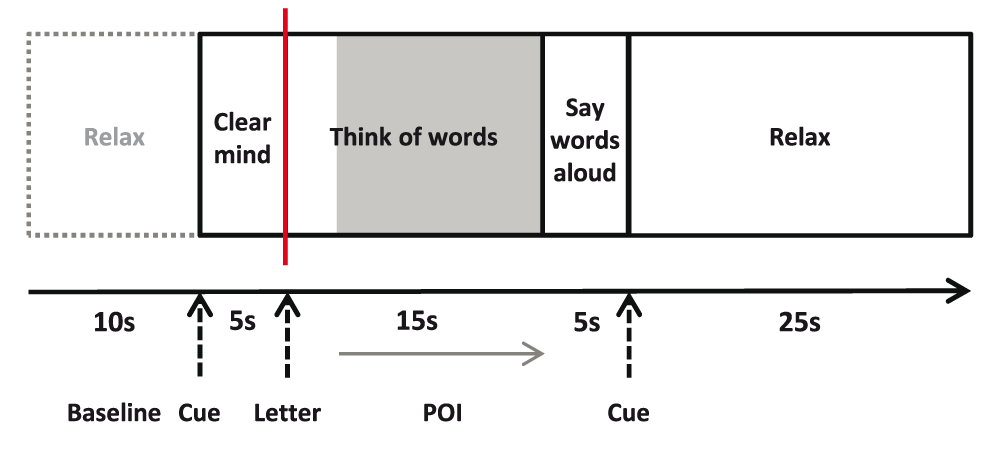

_[N.B. Wellcome Open Research ask that we use a downloaded template for submission, based on the original paper, so this section will be knitted as Word and then pasted in]._

<!--NB. Study2 data on OSF: https://osf.io/ck6rx/
Summary of Results file has some background, including Placement test-->


```{r setup, include=FALSE, warning=FALSE}
knitr::opts_chunk$set(echo = TRUE)

require(tidyverse)
require(flextable)
require(ggplot2)
require(plotrix) #for standard error function 
require(RCurl) #for reading csv from a website
require(httr)
require(BayesFactor)
```

```{r read_data, echo=FALSE, messgae = FALSE}
# read data in from github if it doesn't already exist in working directory
pull_files <- c('Study1_resultsL1.csv', 'Study1_resultsL2.csv', 'Study1_demographics.csv',
                'Study2_resultsL1.csv', 'Study2_resultsL2.csv', 'Study2_demographics.csv')
download <- array(data=NA, dim = length(pull_files))
for (f in 1:length(pull_files)){
  if (!file.exists(pull_files[f])){  
    url <- paste0("https://raw.githubusercontent.com/oscci/Bilingual_Sophie_reanalysis/main/", pull_files[f])
    GET(url, write_disk(pull_files[f]))
  }
}

Study1_L1_data <- read.csv(pull_files[1])
Study1_L2_data <- read.csv(pull_files[2])
Study1_demographics_total <- read.csv(pull_files[3],stringsAsFactors=F)
colnames(Study1_demographics_total)[1] <- 'ID'

# read Japanese data in 
Study2_L1_data <- read.csv(pull_files[4])
Study2_L2_data <- read.csv(pull_files[5])
Study2_demographics_total <- read.csv(pull_files[6],stringsAsFactors=F)

colnames(Study2_demographics_total)[1] <- 'ID'
Study2_demographics_total$ID <- as.numeric(gsub("BL", replacement = "", Study2_demographics_total$ID))

```

# Study 1: Highly proficient French-English or German-English bilinguals

## Methods

### Participants

```{r study1_participants, echo=FALSE, message=FALSE, warning=FALSE}
# How many participants are there, and how many were excluded from the analysis?
nsubj_all <- dim(Study1_L1_data)[1]
# If a subject has data excluded in EITHER language, we'll have to exclude them.
exclude <- Study1_L1_data$L1.exclusions + Study1_L2_data$L2.exclusions
# We will include the rows in L1_data and L2_data for any participants where exclude = 0
Study1_L1_data <- Study1_L1_data[which(exclude==0), ]
Study1_L2_data <- Study1_L2_data[which(exclude==0), ]
# Remove excluded participants from backgound data too
Study1_demographics <- Study1_demographics_total[which(exclude==0), ]
nsubj <- dim(Study1_L1_data)[1]
Study1_demographics <- Study1_demographics %>% mutate(L2_prof = (L2_prof_Speaking+L2_prof_Reading+L2_prof_Understanding)/3)

#Create binary AoA for L2, below 6 or 6 and above
Study1_demographics$AoA<-0
Study1_demographics$AoA[Study1_demographics$L2_Acquisition>5]<-1

# Calculate demographics summary statistics
demo_summary <- Study1_demographics %>% 
  summarise(N_total = n(), N_german = length(which(L1==1)), N_french = length(which(L1==2)),
            N_female = length(which(Gender==0)), N_male = length(which(Gender==1)),
            mean_age = mean(Age), sd_age = sd(Age),
            mean_EHI = mean(EHI), sd_EHI = sd(EHI), min_EHI = min(EHI), max_EHI = max(EHI),
            languages = mean(NoL), sd_languages = sd(NoL),
            mean_aoa = mean(L2_Acquisition), sd_aoa = sd(L2_Acquisition),
            mean_aoF = mean(L2_Fluent), sd_aoF = sd(L2_Fluent),
            mean_accent = mean(L2_exp_Accent), sd_accent = sd(L2_exp_Accent),
            mean_read = mean(L2_prof_Reading), sd_read = sd(L2_prof_Reading),
            mean_und = mean(L2_prof_Understanding), sd_und = sd(L2_prof_Understanding),
            mean_speak = mean(L2_prof_Speaking), sd_speak = sd(L2_prof_Speaking),
            mean_prof = mean(L2_prof), sd_prof = sd(L2_prof))

```

Participants were recruited through the Oxford University German Society and Oxford University French Society, as well as through posters in the Experimental Psychology building. Participants were aged over 18 years and were either German-English (N = `r length(which(Study1_demographics$L1==1))`) or French-English (N = `r length(which(Study1_demographics$L1==2))`) bilinguals, with a self-reported high level of proficiency in English. All had normal or corrected to normal vision. Individuals with a diagnosis of any speech, language or learning impairment, affected by a neurological disorder or taking medication affecting brain function e.g. antidepressants, were not included in the study. 

A total of 40 individuals were assessed for viability as study participants. In total, 14 participants were excluded for a range of reasons, including no suitable Doppler signal, due to the inability to find a suitable temporal window in the skull, or failure to stabilize the Doppler signal for the required amount of time (11 participants), or low quality data (3 participants). Data was collected from `r nsubj_all` participants. During the analysis, `r length(which(exclude!=0))` further participants were dropped because of an insufficient number of useable trials. All further analyses are based on the final sample of `r demo_summary$N_total` participants (`r demo_summary$N_female` female; mean age = `r round(demo_summary$mean_age, 2)` years, sd = `r round(demo_summary$sd_age, 2)` years).

### Ethics Statement
The study was approved by the University of Oxford Central Research Ethics Committee (CUREC), approval number, MS-IDREC-C1-2015-126). All participants provided written informed consent.

### Apparatus
A commercially available transcranial Doppler ultrasonography device (DWL, Multidop T2; manufacturer, DWL Elektronische Systeme, Singen, Germany) was used for continuous measurements of the changes in cerebral blood flow velocity (CBFV) through the left and right MCA. The MCA was insonated at ~5 cm (40–60 mm). Activity in frontal and medial cortical areas, supplied by the anterior cerebral artery, and inferior temporal cortex, supplied by the posterior cerebral artery, do not contribute to the measurements made in the MCA. Two 2-MHz transducer probes, which are relatively insensitive to participant motion, were mounted on a screw-top headset and positioned bilaterally over the temporal skull window (Deppe et al., 2004).

### Handedness
Handedness was not a selection criterion, and was assessed via the Edinburgh Handedness Inventory (EHI; Oldfield, 1971). The inventory consists of 10 items assessing dominance of a person’s right or left hand in everyday activities. Each item is scored on a 5 step scale (“always left”, “usually left”, “both equally”, “usually right”, “always right”). A person can score between -100 and +100 for each item and an overall score is calculated by averaging across all items (“always left” -100; “usually left” -50; “both equally” 0).

### Language History
The Language Experience and Proficiency Questionnaire (LEAP-Q; Marian et al., 2007) was used to assess language history for all participants. The LEAP-Q is a self-assessment questionnaire consisting of nine general questions and seven additional questions per language that explore acquisition history, context of acquisition, current language use, and language preference and proficiency ratings across language domains (speaking, understanding and reading) as well as accent ratings. An overall self-reported proficiency rating was calculated by taking the mean ratings for proficiency in speaking, reading and understanding English.

The main variable of interest from LEAP was age of acquisition of L2 (AoA) ), i.e. answer to the question ‘age when you began acquiring the language’; we subdivided into early AoA (before 6 years of age) and late AoA subgroups, to test the prediction from Hull and Vaid (2007) that language is more bilaterally represented when L2 is learned in early childhood. To characterise the sample, we also report the numbers of languages spoken; age of achieving fluency in English; self-reported strength of foreign accent when speaking English (on a scale from 0 [none] to 10 [pervasive]); and mean self-reported proficiency in English. 


### Word Generation Task
Tasks were programmed using Presentation® software (version 17.2; www.neurobs.com). All instructions were presented centrally in white Arial font on a black background. Each participant was tested in English (L2) and their native language (L1; French or German) in a single session using two tasks, each consisting of 23 trials.

The order of the two languages was counterbalanced across participants and the entire testing session lasted between 75 and 90 minutes. The experimenter spoke English at all times. So that they were focussed on their native language, participants were asked to describe the Cookie Theft picture of the Boston Diagnostic Aphasia Examination in their native language prior to being tested in that language (Goodglass & Kaplan, 1983).

The cued word generation paradigms were based on Knecht and colleagues’ 1998 paradigm (Knecht et al., 1998b). For each trial, the participant is shown a letter and is asked to silently generate words starting with that letter. Each task comprised 23 trials and lasted for around 20 minutes. We excluded the three letters with the lowest first letter word frequency: Q, X and Y in English; Q, X and Z in German; and W, X and Y in French. Written task instructions for the German and French word generation tasks were translated into German and French by the experimenter.

Each trial started with an auditory tone and the written instruction “Clear Mind” (5 s), followed by the letter cue to which the participant silently generated words (15 s), and then overt word generation (5 s) (Figure 1). To restore baseline activity, participants were instructed to relax (25 s) at the end of each trial. Event markers were sent to the Multi-Dop system when the letter cue appeared, denoting trial onset for subsequent analysis of the Doppler signal.



### Data pre-analysis and calculation of asymmetry indices

The cerebral blood flow velocity data were analysed using custom scripts in R Studio (R Studio Team, 2015), which are available on Open Science Framework (link). The data preprocessing followed conventional methods (Deppe, Ringelstein & Knecht, 2004), and included the following steps:

-	Downsampling from 100 Hz to 25 Hz

-	Epoching from -11 s to 30 s relative to the onset of the ‘Clear Mind’ cue

-	Manual exclusion of trials with obvious spiking or dropout artefacts

-	Automated detection of data points with signal intensity beyond 0.0001-0.999 quantiles. If a trial contained one of these extreme data points, it was replaced by the mean for that epoch; if it contained more than one, the trial was excluded from further analysis

-	Normalisation of signal intensity by dividing CBFV values by the mean for all included trials and multiplying by 100

-	Heart cycle integration by averaging the signal intensity from peak to peak of the heart beat

-	Baseline correction by subtracting the mean CBFV across the baseline period (-10s to 0s relative to the ‘Clear Mind’ cue) from all values in the trial

-	Automated detection and rejection of trials containing normalized values below 60 or 140.

Participants with fewer than 15 usable trials for either language were excluded from all further analyses. For each participant that was included in the analysis, a grand mean was calculated over all of their included trials. A laterality index (LI) was calculated by taking the mean of the difference between left and right CBFVs (L-R) within a period of interest (POI) that started 8s after the ‘Clear Mind’ cue (i.e. 3s after the word generation task had begun) and ended at 20s (i.e. when the covert generation task ended). The start time of the POI was chosen to allow time for the blood flow to respond to the task; and the end time was chosen to prevent capturing the response to the overt speech generation phase.

This method of calculating LI using the mean L-R difference across the whole of the POI (the ‘mean’ method) deviates from the conventional method that we had used in the first version of this paper (https://doi.org/10.12688/wellcomeopenres.9869.1). The original 'peak' method, popularised by Deppe, Knecht, Henningsen and Ringelstein (1997) takes the mean of a narrow time window around the peak difference within the POI. This method forces the LI to be either left or right - even if the waveform is close to zero with no clear lateralised peak, the highest absolute value in the POI will be treated as a peak. This creates a bimodal distribution of LIs. We have compared the 'peak' method with our 'mean' method, and shown that, while they give high agreement, the mean method is at least as reliable and gives  normally distributed LI values, albeit with lower values, due to averaging over the whole POI (Woodhead et al., 2020). We have therefore moved to using the mean method in our current research. Nonetheless, peak LI values were computed in case they are required for comparison with other studies, and are available on the online data repository: https://osf.io/4pm76/.

In a final step, to bring our methods in alignment with Woodhead et al (2019), we identified and excluded datasets with unusually high trial-by-trial variability using the Hoaglin and Iglewicz (1987) outlier detection method. For this analysis, LI was calculated for each trial, rather than just for the grand average. The standard error of these single-trial LI values was then calculated. Outliers were  defined as datasets where the standard error was above an upper threshold, calculated as:

Upper threshold = Q3 + 2.2 * (Q3 – Q1)

whereby Q1 is the first quantile of the standard errors among all participants, and Q3 is the third quartile. Participants who had standard error above the upper threshold for either L1 or L2 were excluded from all further analyses.


### Statistical Analysis
All analyses were conducted using the R Programming Language (R Core Team, 2020).  We first checked for a leftward bias in the overall laterality index, using a one-group t-test, and also categorised each participant as left-biased, right-biased or bilateral. The bilateral group were those whose confidence interval around the LI included zero. Split half reliability of the LI was estimated using LIs computed from odd or even trials only. Spearman correlations were computed between LIs for L1 and L2. 

To test our main hypothesis, the association between strength of lateralization (LI values) for L1 and L2 was first visualized using a scatterplot, with the strength of association computed as Spearman's correlation coefficient. Following Woodhead, Rutherford, and Bishop (2020), we adopted an approach based on Bland and Altman (1986) to determine whether the individual LIs for L1 and L2 were equivalent. This involves specifying boundaries for the expected distribution of difference scores, which should contain 95% of bivariate points, if the two values are equivalent. The expected range can be computed from knowledge of the task reliability. We adopted the range specified by Woodhead et al (2020); they computed difference scores by LIs for odd vs even trials, and set boundaries corresponding to expected mean of zero +/-1.96 standard deviations. If the two measures are equivalent, 95% of difference scores, the repeatability coefficient, between LIs for L1 and L2 should fall in this range (from -2.5 to 2.5).

For our second hypothesis, that laterality for L2 would be associated with AoA, we used a t-test to compare laterality for L2 between those with early vs late AoA. A two-tailed test was used because the literature does not give clear predictions about direction of effect.

In addition, we report the correlation between LI values and strength of handedness (EHI quotient), and the impact of testing order (L1 then L2, or L2 then L1).


```{r study1_descriptive_statistics, echo=FALSE, message=FALSE, warning=FALSE}
# Calculate mean and SEM LI value for L1 and L2
L1_summary_stats <- Study1_L1_data %>% summarise(L1_mean = mean(L1.mean_LI), 
                                                 L1_se = sd(L1.mean_LI)/sqrt(nsubj),
                                                 L1_mean_trials = mean(L1.N), 
                                                 L1_min_trials = min(L1.N), 
                                                 L1_max_trials = max(L1.N)) 

L2_summary_stats <- Study1_L2_data %>% summarise(L2_mean = mean(L2.mean_LI), 
                                                 L2_se = sd(L2.mean_LI)/sqrt(nsubj),
                                                 L2_mean_trials = mean(L2.N), 
                                                 L2_min_trials = min(L2.N), L2_max_trials = max(L2.N)) 

# Number of Ps left/ bilaterally lateralised
L1_laterality <- Study1_L1_data %>% group_by(L1.mean_laterality) %>% summarise(N=n(), pc=N/nsubj*100)
L2_laterality <- Study1_L2_data %>% group_by(L2.mean_laterality) %>% summarise(N=n(), pc=N/nsubj*100)


# Make a massive table
summary_stats <- matrix(data = NA, nrow = 2, ncol = 7)
colnames(summary_stats) <- c('Language','Mean trials', 'mean LI', 'se LI', '% left', '% bilateral', '% right')
summary_stats[, 1] <- c('L1', 'L2')
summary_stats[, 2] <- round(c(L1_summary_stats$L1_mean_trials, L2_summary_stats$L2_mean_trials), 2)
summary_stats[, 3] <-  round(c(L1_summary_stats$L1_mean, L2_summary_stats$L2_mean), 2)
summary_stats[, 4] <-  round(c(L1_summary_stats$L1_se, L2_summary_stats$L2_se), 2)
summary_stats[, 5] <- round(c(L1_laterality$pc[2], L2_laterality$pc[2]))
summary_stats[, 6] <- round(c(L1_laterality$pc[1], L2_laterality$pc[1]))
summary_stats[, 7] <- round(c(L1_laterality$pc[3], L2_laterality$pc[3]))
summary_stats[which(is.na(summary_stats[,7])), 7] <- 0 
summary_stats <- as.data.frame(summary_stats)

# Scatterplot of L1 and L2 data
plotdata <- inner_join(x = Study1_L1_data,
                        y = Study1_L2_data)
plotdata<-cbind(plotdata,Study1_demographics$AoA)
colnames(plotdata)[ncol(plotdata)] <- 'AoA'
plotdata$AoA <- as.factor(plotdata$AoA)
levels(plotdata$AoA)<-c('Early','Late')

# Correlation between L1 and L2
L1_L2_corr <- cor.test (plotdata$L1.mean_LI, plotdata$L2.mean_LI, 
                        method = "spearman", 
                        exact = FALSE)
```

```{r function_dofigure,echo=FALSE, messgae = FALSE,warning=FALSE} 
#As we'll make several figures of this kind, we'll make a generic function
dofigure <- function(plotdata,L1,L2,colourcol,pchcol,xlab,ylab,captiontitle1,captiontitle2,xlim,ylim,correlcoef,BlandAltmanlimit,L1se,L2se,showpch){

  myfig <- ggplot(plotdata, aes(x = L1, y = L2,col=colourcol,pch=pchcol)) + 
  geom_point()+
  #theme_bw()+
  xlab(xlab) +  
  ylab(ylab) + 
  xlim(xlim) + ylim(ylim) +
  geom_errorbar(aes(ymin = L2 - L2se, ymax = L2 + L2se),linetype = "solid",size=.3) + 
  geom_errorbarh(aes(xmin = L1 - L1se, xmax = L1 + L1se), linetype = "solid",size=.3) +
  annotate("text",x = 2, y = 7, label = paste('r = ', correlcoef),col='black') +
  geom_hline(yintercept = 0, linetype="solid", alpha = 0.8) + 
  geom_vline(xintercept = 0, linetype= "solid", alpha = 0.8)  + 
  geom_abline(intercept = 0, slope = 1,size=.5,col='grey')+
  geom_abline(intercept = BlandAltmanlimit, slope = 1,linetype="dashed",size=.5,col='grey')+
  geom_abline(intercept = -BlandAltmanlimit, slope = 1,linetype="dashed",size=.5,col='grey')+
  scale_color_discrete(name = captiontitle1)+
    guides(pch=FALSE)
  
return(myfig)
}
```

```{r function_doGrandmean, echo=FALSE, message=FALSE, warning=FALSE}
doGrandmean <- function(study, task){
  if (study == 1){
    POI_start = 8
    data_dir = 'Study1_Grand_Means'
    end_time = 29}
  if (study == 2){
    POI_start = 6
    data_dir = 'Study2_Grand_Means'
    end_time = 24}

  for (l in 1:2){
    if (study == 1){
      myfiles <- list.files(path = data_dir, pattern = paste0('*_L',l,'.csv'))}
    if (study == 2){
      myfiles <- list.files(path = data_dir, pattern = paste0('*_L',l,'_',task,'.csv'))}
    nfiles <- length(myfiles)
    # Prepare dataframes
    mydata <- read.csv(paste0(data_dir,'/',myfiles[1])) # Use first data file to determine matrix size
    myrows <- dim(mydata)[1]
    Ldata <- matrix(data=NA, nrow = myrows, ncol=nfiles)
    Rdata <- matrix(data=NA, nrow = myrows, ncol=nfiles)
    for (f in 1:nfiles){
      mydata <- read.csv(paste0(data_dir,'/',myfiles[f]))
      Ldata[,f] <- mydata$Lmean
      Rdata[,f] <- mydata$Rmean
      time <- mydata$time
    }
    # Calculate grandmean
    if (l==1){
      grandmean <- data.frame('L1_Left' = rowMeans(Ldata),
                            'L1_Right' = rowMeans(Rdata))}
    if (l==2){
      grandmean$L2_Left <- rowMeans(Ldata)
      grandmean$L2_Right <- rowMeans(Rdata)}
  }
  grandmean$time = time

  # Crop to -10 to 30 seconds
  start_index <- which(time==-10)
  end_index <- which(time==end_time)
  xtime <- time[start_index:end_index]
  grandmean <- grandmean[start_index:end_index, ]

  # Make data longer
  grandmean_long <- pivot_longer(data=grandmean, cols=c(1:4), names_to = 'Condition', values_to='Velocity')

  # Make plot
  myfig <- ggplot(data=grandmean_long, aes(x=time, y=Velocity, group=Condition)) +
    geom_line(aes(colour=Condition)) +
    geom_hline(yintercept = 100, linetype="solid", alpha = 0.8) +
    geom_vline(xintercept = 0, linetype="solid", alpha = 0.8) +
    scale_y_continuous(breaks = seq(94, 104, by=2)) +
    geom_vline(xintercept = -10, linetype = "dashed", alpha = 0.8) + # Start of Baseline
    geom_vline(xintercept = 0, linetype = "dashed", alpha = 0.8) + # End of Baseline
    geom_vline(xintercept = POI_start, linetype = "dashed", alpha = 0.8) + # Start of POI
    geom_vline(xintercept = 20, linetype = "dashed", alpha = 0.8)  # End of POI

  return(myfig)
}
  
```

```{r correlcheck,echo=FALSE, messgae = FALSE,warning=FALSE}
# Check correlations with EHI
EHI_LI_L1_cor <- cor.test (Study1_demographics$EHI, Study1_L1_data$L1.mean_LI, method = "spearman")
EHI_LI_L2_cor <- cor.test (Study1_demographics$EHI, Study1_L2_data$L2.mean_LI, method = "spearman")

# Check for effect of testing order (0 = L2 tested first, 1 = L1 tested first)
total_info <- inner_join(x = plotdata, y = Study1_demographics, by = c("ID"))
nL1_testedfirst <- nrow(Study1_demographics[Study1_demographics$Tested == 1,]) #how many tested with L1 first
nL1_testedsecond <- nrow(Study1_demographics[Study1_demographics$Tested == 0,]) # how many tested with L2 first
testing_0 <- filter(total_info, Tested == "0")
testing_1 <- filter(total_info, Tested == "1")
testing_ttest_L1 <- t.test(testing_0$L1.mean_LI, testing_1$L1.mean_LI) # testing if there is a sig. diff between laterality scoes of L1 in those tested in their native language first or second.
testing_ttest_L2 <- t.test(testing_0$L2.mean_LI, testing_1$L2.mean_LI) # testing if there is a sig. diff between laterality scoes of L2 in those tested in their native language first or second.
```
## Results

### Handedness

Summary statistics for the EHI handedness measure can be seen in Table 1. Of 24 participants included in the data analysis, 23, had EHI values above 0, indicating right handedness. The remaining participant had an EHI of -20, indicating weak left handedness. Correlations between LI from fTCD and handedness scores on the EHI, were not statistically distinguishable from zero for either L1 (r = `r round(EHI_LI_L1_cor$estimate, 3)`) or L2 (r = `r round(EHI_LI_L2_cor$estimate, 3)`).

```{r table1, echo=FALSE, warning=FALSE,message=FALSE}
# Make a demographics table
demo_table <- matrix(data=NA, nrow=10, ncol=2)
colnames(demo_table) <- c('Characteristic', 'Mean (sd)')
demo_table[,1] <- c('Age, years', 'EHI/100', 'Languages spoken',
                    'Age of English acquisition, years', 'Age of English fluency, years', 
                    'English accent/10', 'English overall rating/10',
                    'English speaking rating/10', 'English listening rating/10', 'English reading rating/10')
#demo_table[1,2] <- paste0(demo_summary$N_total, ' (', demo_summary$N_male, ':', demo_summary$N_female, ')')
demo_table[1,2] <- paste0(round(demo_summary$mean_age, 2), ' (', round(demo_summary$sd_age, 2), ')')
demo_table[2,2] <- paste0(round(demo_summary$mean_EHI, 2), ' (', round(demo_summary$sd_EHI, 2), ')')
demo_table[3,2] <- paste0(round(demo_summary$languages, 2), ' (', round(demo_summary$sd_languages, 2), ')')
demo_table[4,2] <- paste0(round(demo_summary$mean_aoa, 2), ' (', round(demo_summary$sd_aoa, 2), ')')
demo_table[5,2] <- paste0(round(demo_summary$mean_aoF, 2), ' (', round(demo_summary$sd_aoF, 2), ')')
demo_table[6,2] <- paste0(round(demo_summary$mean_accent, 2), ' (', round(demo_summary$sd_accent, 2), ')')
demo_table[7,2] <- paste0(round(demo_summary$mean_prof, 2), ' (', round(demo_summary$sd_prof, 2), ')')
demo_table[8,2] <- paste0(round(demo_summary$mean_speak, 2), ' (', round(demo_summary$sd_speak, 2), ')')
demo_table[9,2] <- paste0(round(demo_summary$mean_und, 2), ' (', round(demo_summary$sd_und, 2), ')')
demo_table[10,2] <- paste0(round(demo_summary$mean_read, 2), ' (', round(demo_summary$sd_read, 2), ')')


demo_table <- as.data.frame(demo_table)

table1 <- flextable(demo_table) %>% set_caption(table1, caption=paste0('Table 1. Demographics for the Study 1 participants, N=',nsubj, ' (', demo_summary$N_female, ' female)')) 
table1 <- autofit(table1)
table1
```

### Language History

Summary statistics for the language history questionnaire can be seen in Table 1. Self-reported proficiency in speaking, reading and understanding English were all generally high (all around 9/10), with a minimum for any individual rating of 6/10. Age of acquisition, defined as age when first started acquiring the language, was more variable, ranging from `r min(Study1_demographics$L2_Acquisition)` to `r max(Study1_demographics$L2_Acquisition)` years. Binary categorisation of AoA, using Hull and Vaid's (2006) criteria gave `r length(which(Study1_demographics$AoA==0))` cases of early AoA (below 6 years of age), and `r length(which(Study1_demographics$AoA==1))` cases of late AoA.

### fTCD Data Quality and Reliability

```{r study1_data_quality, echo=FALSE, warning=FALSE,message=FALSE}
# Report number of excluded trials
excluded_trials_L1 <- 100 - round(sum(Study1_L1_data$L1.N) / sum(Study1_L1_data$L1.nMark) * 100, 2)
excluded_trials_L2 <- 100 - round(sum(Study1_L2_data$L2.N) / sum(Study1_L2_data$L2.nMark) * 100, 2)

# Here we will use the Shapiro Wilks normality test to see if the LI values for L1 and L2 are normally distributed
L1_normality <- shapiro.test(Study1_L1_data$L1.mean_LI)
L2_normality <- shapiro.test(Study1_L2_data$L2.mean_LI)

# spearman correlation test on odds and evens - means: Study1 data 
L1_splithalf <- cor.test(Study1_L1_data$L1.mean_odd, Study1_L1_data$L1.mean_even, method = "spearman")
L2_splithalf <- cor.test(Study1_L2_data$L2.mean_odd, Study1_L2_data$L2.mean_even, method = "spearman")  

#Bayes factor for comparison of means
bft<-ttestBF(Study1_L2_data$L2.mean_LI,Study1_L1_data$L1.mean_LI,paired=TRUE)
bf_1<-round(as.data.frame(bft)$bf,3)
```

  
  As mentioned in the Methods, `r length(which(exclude!=0))` participants were excluded from the analysis because of insufficient number of usable trials. For the remaining `r length(which(exclude==0))` participants, `r excluded_trials_L1`% of trials were excluded for L1, and `r excluded_trials_L2`% for L2.
  
  Normality of the LI values was assessed using Shapiro-Wilk tests. Distributions of LIs were unimodal for both L1 and L2. Data for L1 did not significantly deviate from normality (W = `r round(L1_normality$statistic, 2)`, p = `r round(L1_normality$p.value, 3)`), whereas data for L2 were significantly non-normal (W = `r round(L2_normality$statistic, 2)`, p = `r round(L2_normality$p.value, 3)`), showing a rightward skew.

  Split-half reliability was assessed by correlating the LI values from odd and even trials. The Spearman's correlation for the L1 data was `r round(L1_splithalf$estimate, 2)`, and for the L2 data it was `r round(L2_splithalf$estimate, 2)`, indicating medium to good within-session reliability.  
  
  Normalized blood flow velocities for the left and right middle cerebral arteries  are presented for each task in Figure 2. 
  
```{r Fig2, warning=FALSE, message=FALSE, echo=FALSE}
Fig2 <- doGrandmean(1)
print(Fig2)

```
 
_Figure 2. Left and right hemisphere activation is displayed as a function of epoch time in seconds for the word generation task for L1 (French or German) and L2 (English) in Study 1. Dotted lines indicate the start and end of the baseline period (from -10 to 0 seconds) and the period of interest (from 8 to 20 seconds). L1, first language; L2, second language._


  Table 2 shows summary statistics for the LI values for L1 and L2.  The Bayes factors was computed to check the equivalence of the mean LI for the two languages using the R package 'BayesFactor' with default settings (Morey & Rouder, 2018), and gave a value of `r bf_1`, which may be interpreted as moderate evidence for the null hypothesis (Lee & Wagenmakers, 2014). The percentage of participants in each group categorised as left lateralised, bilateral or right lateralised is also shown. The majority of participants were left lateralised, with only around 10% showing bilateral activation. No participants showed right lateralisation for either L1 or L2. T-tests showed that there were no significant effects of testing order on LI values, either for L1 (p = `r round(testing_ttest_L1$p.value, 3)`) or L2 (p = `r round(testing_ttest_L2$p.value, 3)`).
  <!---ref is Lee, M. D., & Wagenmakers, E. J. (2014). Bayesian Cognitive Modeling: A practical course. Cambridge University Press.--->
<!---ref is  Morey, R. D. & Rouder, J. M. (2018). BayesFactor: Computation of Bayes
  Factors for Common Designs. R package version 0.9.12-4.2.
  https://CRAN.R-project.org/package=BayesFactor.--->
  


```{r Table2, warning=FALSE,echo=FALSE, warning=FALSE,message=FALSE}
myn <-length(which(exclude==0))
mycap<-paste0('Table 2. Summary statistics for Study 1 laterality indices (N = ',myn,')')
table2 <- flextable(summary_stats) %>% set_caption(table2, caption=mycap)
table2 <- autofit(table2)
table2

```
  
  As can be seen in the scatterplot in Figure 3, laterality indices for L1 and L2 were similar, with Spearman's R = `r round(L1_L2_corr$estimate, 3)`. Furthermore, the points cluster around the continuous grey line, which shows the point of equivalence between L1 and L2, and all but one point falls within the Bland-Altman bounds (dotted grey lines), as would be expected if L1 and L2 were equivalent.  

```{r Fig3, warning=FALSE, message=FALSE, echo=FALSE}
Fig3 <- dofigure(plotdata=plotdata,
                 L1 = plotdata$L1.mean_LI,
                 L2 = plotdata$L2.mean_LI,
                 colourcol = plotdata$AoA,
                 pchcol = as.factor(rep(16,nrow(plotdata))), #use pch of 16 for all points - this is used to code different pch by proficiency in figs 2 and 3
                 xlab="LI for L1 (French / German)",
                 ylab="LI for L2 (English)",
                 captiontitle1 = "Age of Acquisition",
                 captiontitle2 = " ",
                 xlim= c(-2,9),
                 ylim = c(-2,9),
                 correlcoef = round(L1_L2_corr$estimate, 3),
                 BlandAltmanlimit = 2.5,
                L1se = plotdata$L1.mean_se,
                 L2se = plotdata$L2.mean_se,
                showpch = 0)
print(Fig3)

```
  
  _Figure 3. Scatterplot showing individual mean LIs in L1 and L2, with horizontal and vertical error bars denoting standard errors. The continuous grey line corresponds to the point of equality of the two measures, and the dotted lines show the limits where difference between LIs is +/- 2.5._  
  

### Effect of Age of Acquisition

```{r study1_aoa, echo=FALSE, messgae = FALSE, warning=FALSE}
#This plot now superseded as AoA shown in main scatterplot
# Figure numbers changed accordingly.

# Correlation between AOA and LIs
aoa_L2_corr <- cor.test(total_info$L2_Acquisition, total_info$L2.mean_LI, method = "spearman")
aoF_L2_corr <- cor.test(total_info$L2_Fluent, total_info$L2.mean_LI, method = "spearman")
prof_L2_corr <- cor.test(total_info$L2_prof, total_info$L2.mean_LI, method="spearman")

myt <- t.test(plotdata$L2.mean_LI~plotdata$AoA)

```


 One can see by inspection of Figure 3 that there is no evidence of a trend for lower LI for L2 in those with early AoA, and a t-test of differences in L2 LI for those with early and late AoA revealed no differences:  t = `r round(myt$statistic,2)`, p = `r round(myt$p.value,3)`.  For a more quantitative assessment of association, we computed Spearman's correlations between the LI values for L2 (English) and the age of acquisition of English. This was not statistically different from zero (r = `r round(aoa_L2_corr$estimate, 2)`, p = `r round(aoa_L2_corr$p.value, 3)`).

## Discussion
```{r bilatcases,echo=FALSE}
myt<-table(Study1_L1_data$L1.mean_laterality,Study1_L2_data$L2.mean_laterality)
#2 x 2 table to check if bilateral are concordant

```

Nearly all participants showed significant left lateralised blood-flow for both L1 and L2 during the word generation task. Only `r myt[1,2]+myt[2,1]` participants were classified as bilateral for one language, and for `r myt[2,1]` of these it was L1 that was bilateral.
Furthermore, asymmetry indices for L1 and L2 were highly related and similar in magnitude, indicating good reliability of the measure. 
Proficiency was generally high in this sample, so it was not possible to assess the impact of variation in proficiency on lateralisation. The sample was small, and so lacking in power to detect small effects, but there was no indication of support for the hypothesis that AoA affected absolute levels of language lateralisation or was related to a difference in lateralisation between the two languages.


# Study 2: Japanese-English bilinguals with moderate-high proficiency
In Study 1 we found no difference in laterality patterns for L1 and L2 between French-English and German-English bilinguals, but it is possible that differences might be more apparent with languages that are more different from one another, in grammatical structure, lexical items and/or phonology. These factors have been shown to influence the ease with which a second language is learned, and might plausibly affect the extent to which language representations are shared or distinct ( Schepens et al., 2016).  Study 2 provided the opportunity to assess this idea in a sample of adults whose native language was Japanese, with English as the L2.  

Study 2 was run independently of Study 1, at a different institution by different experimenters, to address similar questions to Study 1, but with Japanese-English bilinguals. We report the two studies together here as they make it possible to test generalisability of the Study 1 findings in different languages, and with some methodological modifications. In addition, Study 2 included bilinguals with a wider range of proficiency than Study 1, making it possible to consider the effect of this variable on lateralisation.  

An additional aim of Study 2 was to test whether a language that uses both logographic and syllabic  orthographic systems would show a more pronounced difference in laterality between phonological and semantic processing (cf, Gutierrez-Sigut, Payne & MacSweeney, 2015). Japanese kana carry phonological information, but kanji are more strongly linked to semantic information. We therefore expected that semantic fluency would be less reliant on pre-motor articulatory planning processes than phonological fluency, and may therefore be less strongly left-lateralized. 

## Methods

### Participants

```{r study2_participants, echo=FALSE, warning=FALSE, message=FALSE}
# How many participants are there, and how many were excluded from the analysis?
Study2_nsubj <- dim(Study2_L1_data)[1]

#Study2_L1_data had NA for exclusions - need to fix this
w<-which(is.na(Study2_L1_data$L1_Phon.exclusions))
Study2_L1_data$L1_Phon.exclusions[w] <-0
w<-which(is.na(Study2_L1_data$L1_Sem.exclusions))
Study2_L1_data$L1_Sem.exclusions[w] <-0

# If a subject has data excluded in EITHER language, we'll have to exclude them
# Phonological and Semantic fluency tasks will be treated separately
Phon_exclude <- Study2_L1_data$L1_Phon.exclusions + Study2_L2_data$L2_Phon.exclusions
Sem_exclude <- Study2_L1_data$L1_Sem.exclusions + Study2_L2_data$L2_Sem.exclusions 
Study2_exclude <- Phon_exclude + Sem_exclude

# We will include the rows in L1_data and L2_data for any participants where exclude = 0
L1_Phon_data <- Study2_L1_data[which(Study2_exclude==0), ]
L2_Phon_data <- Study2_L2_data[which(Study2_exclude==0), ]
L1_Sem_data <- Study2_L1_data[which(Study2_exclude==0), ]
L2_Sem_data <- Study2_L2_data[which(Study2_exclude==0), ]

# How many subjects were included for each task?
Phon_nsubj <- dim(L1_Phon_data)[1]
Sem_nsubj <- dim(L1_Sem_data)[1]

# Add column for english proficiency category: < 40 = basic, > 40 = intermediate, > 48 = advanced
Study2_demographics_total$Eng_cat <- NA
Study2_demographics_total$Eng_cat[which(Study2_demographics_total$Eng_score < 40)] <- "basic"
Study2_demographics_total$Eng_cat[which(Study2_demographics_total$Eng_score >= 40)] <- "intermediate"
Study2_demographics_total$Eng_cat[which(Study2_demographics_total$Eng_score >= 48)] <- "advanced"
Study2_demographics_total$Eng_cat <- factor(Study2_demographics_total$Eng_cat, levels = c("basic", "intermediate","advanced", "NA"))

# Remove excluded participants from background data too
Study2_demographics <- Study2_demographics_total[which(Study2_exclude==0), ]

# Calculate demographics summary statistics (female = Gender 0)

Study2_demo_summary <- Study2_demographics %>%
  summarise(N_total = n(), N_female_j = length(which(Gender == "0")), N_male_j = length(which(Gender== "1")),
            mean_age_j = mean(Age, na.rm = TRUE), sd_age = sd(Age, na.rm = TRUE), 
            mean_aoa_L2_j = mean(aoa_L2, na.rm = TRUE), sd_aoa_L2_j = sd(aoa_L2, na.rm = TRUE),
            mean_eng_score_j = mean(Eng_score, na.rm = TRUE), sd_eng_score_j = sd(Eng_score, na.rm = TRUE),
            mean_eng_use_month_j = mean(length_useEng_months, na.rm = TRUE), sd_eng_use_month_j = sd(length_useEng_months, na.rm = TRUE),
            mean_eng_speak_j = mean(Eng_Speak, na.rm = TRUE), sd_eng_speak_j = sd(Eng_Speak, na.rm = TRUE),
            mean_eng_listen_j = mean(Eng_Listen, na.rm = TRUE), sd_eng_listen_j = sd(Eng_Listen, na.rm = TRUE),
            mean_eng_read_j = mean(Eng_Read, na.rm = TRUE), sd_eng_read_j = sd(Eng_Read, na.rm = TRUE), 
            mean_eng_write_j = mean(Eng_Write, na.rm = TRUE), sd_eng_write_j = sd(Eng_Write, na.rm = TRUE),
            )

```

Participants were native speakers of Japanese, living in the London area and using English on a daily basis. All were self-reported right-handers, and none reported any reading or language difficulties. 

A total of `r Sem_nsubj` participants were included in the final analysis, after excluding `r length(which(Study2_exclude!=0))` participant due to poor quality data. All analyses are based on the final sample of `r Study2_demo_summary$N_total` participants (`r Study2_demo_summary$N_female` female, mean age = `r round(Study2_demo_summary$mean_age, 2)` years, sd = `r round(Study2_demo_summary$sd_age, 2)` years).

### Ethics Statement

Ethical approval for the study was granted by the UCL Research Ethics Committee (ID:3612/001). Participants gave written informed consent and were aware they could withdraw at any time. 	 

### Language History and Ability

Age of acquisition of English and number of years of using English were evaluated via self-report.  As with Study 1, a binary age of acquisition (AoA) variable was created by subdividing participants into early (below 6 years) and late (6 years or over) subgroups.  

English language ability was measured using the Quick Placement Test (University of Cambridge Local Examinations Syndicate, 2001), which assesses English reading, vocabulary, and grammar. The test is scored out of 60. Those who scored under 40 were classed as having basic level proficiency (N = `r as.numeric(table(Study2_demographics$Eng_cat)[1])`); between 40 and 48 were classed as having intermediate level proficiency (N = `r as.numeric(table(Study2_demographics$Eng_cat)[2])`); and above 48 were classed as having advanced level proficiency (N = `r as.numeric(table(Study2_demographics$Eng_cat)[3])`). The test data was not available for one participant.

### fTCD Apparatus

Blood flow velocity through the left and right MCAs was examined using a DopplerBox ultrasonography device and DiaMon headset (manufactured by DWL Elektronische Systeme, Singen, Germany). Two 2-MHz transducer monitoring probes were mounted on the headset and placed at each temporal skull window. 	

### Word Generation Tasks
Stimuli were presented using Cogent toolbox (http://www.vislab.ucl.ac.uk/cogent) for MATLAB (Mathworks Inc., Sherborn, MA). Triggers time locked to the onset of the stimulus were sent from the presentation PC to the Doppler Box set-up.

The task was based on Gutierrez-Sigut, Payne, and MacSweeney (2015), and involved phonological and semantic word generation tasks in English and Japanese, with order counterbalanced across participants. Task instructions were delivered to correspond to the tested language. Unlike in Study 1, there was no silent interval for covert word generation: participants spoke the words aloud as they thought of them.  Gutierrez-Sigut et al. had previously shown that LIs were similar regardless of whether overt or covert responses were given, and they noted a benefit of overt production was that the experimenter could record the participants' responses as they occurred. For each trial, participants saw "Clear Mind" presented on the screen for 3 seconds. The cue stimulus was then presented, and participants had 17 seconds to overtly generate as many words as possible. Participants were then instructed to relax for 16 seconds to restore baseline activity. Each trial lasted a total of 36 seconds.  

### Stimuli
#### Phonological Word Generation - Japanese and English
In Japanese, participants were presented with a cue in Hiragana, one of the Japanese phonological scripts.  Following the Japanese mora frequency analysis conducted by Dan et al. (2012) based on the familiarity ratings in Amano & Kondo (1999), 10 of the 12 most frequent moras that are positioned at the beginning of words were selected (あ/a/, い/i/, お/o/, か/ka/, き/ki/, こ/ko/, さ/sa/, し/shi/, た/ta/, ふ/hu/). The two moras omitted were は (/ha/) and じ (/ji/). は was omitted because it would be pronounced /wa/ when it was the subject-marker and じ was omitted because it was the voiced sound of し (/shi/) that was included in the stimuli. Participants had to produce as many words as possible that began with the specified Kana. Each Kana was presented twice, and the 20 trials  were presented in a pseudo-randomised order to ensure all 10 cues had been presented once before a cue was repeated. 

In the English phonological word generation task, participants were presented with 10 alphabetic letters (A, B, C, F, H, M, O, S, T, W) and asked to produce as many words as possible that began with the specified letter. Trials were presented in the same manner as the Japanese task.

#### Semantic Word Generation - Japaneseand English
10 Japanese words representing semantic categories were presented: farm animals, zoo animals, vegetables, fruits, drinks, colours, sports, pets, tools, and transport. 
The same semantic categories were presented in English. Participants had to report as many words that matched these categories as possible. Each category was repeated twice in the semantic fluency blocks. Categories were presented in a pseudo-randomised order.  Participants had to report as many words that matched these categories as possible. Each category was repeated twice in the semantic fluency blocks. Categories were presented in a pseudo randomised order. 

### fTCD Analysis

```{r dofig5, echo=FALSE, warning=FALSE, message=FALSE}
# Plot Study2 Phon L1 and L2 data
plotdata_Phon <- inner_join(x = L1_Phon_data, L2_Phon_data)
plotdata_Phon <- inner_join(x = plotdata_Phon, y = Study2_demographics, by = c("ID"))

plotdata_Phon$AoA <-0 #need to have code for cases where NA
plotdata_Phon$AoA[plotdata_Phon$aoa_L2<6]<-1
plotdata_Phon$AoA[plotdata_Phon$aoa_L2>5]<-2
plotdata_Phon$AoA<-as.factor(plotdata_Phon$AoA)
levels(plotdata_Phon$AoA)<-c('Early','Late')

L1_L2_Phon_corr <- cor.test (plotdata_Phon$L1_Phon.mean_LI, plotdata_Phon$L2_Phon.mean_LI, method = "spearman")

Fig5a <- dofigure(plotdata=plotdata_Phon,
                 L1 = plotdata_Phon$L1_Phon.mean_LI,
                 L2 = plotdata_Phon$L2_Phon.mean_LI,
                 colourcol = plotdata_Phon$AoA,
                  pchcol = as.factor(rep(16,nrow(plotdata_Phon))),
                # pchcol = plotdata_Phon$Eng_cat, #use pch of 16 for all points
                 xlab="LI for L1 (Japanese)",
                 ylab="LI for L2 (English)",
                 captiontitle1 = "Age of Acquisition",
                 captiontitle2 = "English Proficiency",
                 xlim= c(-2,9),
                 ylim = c(-2,9),
                 correlcoef = round(L1_L2_Phon_corr$estimate, 3),
                 BlandAltmanlimit = 2.5,
                L1se = plotdata_Phon$L1_Phon.mean_se,
                 L2se = plotdata_Phon$L2_Phon.mean_se,
                 showpch=TRUE)

# Plot Study2 Sem L1 and L2 data
plotdata_Sem <- inner_join(x = L1_Sem_data, y = L2_Sem_data)
plotdata_Sem <- inner_join(x = plotdata_Sem, y = Study2_demographics, by = c("ID"))

L1_L2_Sem_corr <- cor.test (plotdata_Sem$L1_Sem.mean_LI, plotdata_Sem$L2_Sem.mean_LI, method = "spearman")

plotdata_Sem$AoA <-plotdata_Phon$AoA

Fig5b <- dofigure(plotdata=plotdata_Sem,
                 L1 = plotdata_Sem$L1_Sem.mean_LI,
                 L2 = plotdata_Sem$L2_Sem.mean_LI,
                 colourcol = plotdata_Sem$AoA,
                 pchcol = as.factor(rep(16,nrow(plotdata_Sem))),
                # pchcol = plotdata_Phon$Eng_cat, #use pch of 16 for all points
                 xlab="LI for L1 (Japanese)",
                 ylab="LI for L2 (English)",
                 captiontitle1 = "Age of Acquisition",
                 captiontitle2 = "English Proficiency",
                 xlim= c(-2,9),
                 ylim = c(-2,9),
                 correlcoef = round(L1_L2_Sem_corr$estimate, 3),
                 BlandAltmanlimit = 2.5,
                L1se = plotdata_Sem$L1_Sem.mean_se,
                 L2se = plotdata_Sem$L2_Sem.mean_se,
                 showpch=TRUE)

#Bayes factor for comparison of means
bft<-ttestBF(Study2_L1_data$L1_Phon.mean_LI,Study2_L2_data$L2_Phon.mean_LI,paired=TRUE)
bf_2<-round(as.data.frame(bft)$bf,3)
bft<-ttestBF(Study2_L1_data$L1_Sem.mean_LI,Study2_L2_data$L2_Sem.mean_LI,paired=TRUE)
bf_3<-round(as.data.frame(bft)$bf,3)
```


```{r correlcheckStudy2,echo=FALSE, warning=FALSE,message=FALSE}
# Check correlations with EHI
#TO COMPLETE
# EHI_LI_L1_Phon_cor <- cor.test (background_data$EHI, L1_data$L1_Phon.mean_LI, method = "spearman")
# EHI_LI_L2_Phon_cor <- cor.test (background_data$EHI, L2_data$L2_Phon.mean_LI, method = "spearman")
# EHI_LI_L1_Sem_cor <- cor.test (background_data$EHI, L1_data$L1_Sem.mean_LI, method = "spearman")
# EHI_LI_L2_Sem_cor <- cor.test (background_data$EHI, L2_data$L2_Sem.mean_LI, method = "spearman")

# Check for effect of testing order (0 = L2 tested first, 1 = L1 tested first)
# TO COMPLETE
# total_info <- inner_join(x = plotdata_j, y = background_data, by = c("ID"))
# nL1_testedfirst <- nrow(background_data[background_data$Tested == 1,]) #how many tested with L1 first
# nL1_testedsecond <- nrow(background_data[background_data$Tested == 0,]) # how many tested with L2 first
# testing_0 <- filter(total_info, Tested == "0")
# testing_1 <- filter(total_info, Tested == "1")
# testing_ttest_L1 <- t.test(testing_0$L1.mean_LI, testing_1$L1.mean_LI) # testing if there is a sig. diff between laterality scoes of L1 in those tested in their native language first or second.
# testing_ttest_L2 <- t.test(testing_0$L2.mean_LI, testing_1$L2.mean_LI) # testing if there is a sig. diff between laterality scoes of L2 in those tested in their native language first or second.

```

```{r summarytab3,echo=FALSE, echo=FALSE, warning=FALSE,message=FALSE}
#DB: I moved this because it's easiest to work with the plotdata file, which has just the cases we are including. Also used std.error function from Plotrix, to ensure correct N used for SE 

# Calculate mean and SEM LI value for L1 and L2: Phonological fluency
L1_Phon_summary_stats <-
  plotdata_Phon %>% summarise(L1_mean = mean(L1_Phon.mean_LI), L1_se = std.error(L1_Phon.mean_LI),
                                  L1_mean_trials = mean(L1_Phon.N), L1_min_trials = min(L1_Phon.N),
                                  L1_max_trials = max(L1_Phon.N))

L2_Phon_summary_stats <-
  plotdata_Phon %>% summarise(L2_mean = mean(L2_Phon.mean_LI), L2_se = std.error(L2_Phon.mean_LI),
                                  L2_mean_trials = mean(L2_Phon.N), L2_min_trials = min(L2_Phon.N),
                                  L2_max_trials = max(L2_Phon.N))

# The mean and SEM LI value for L1 and L2: Semantic fluency
L1_Sem_summary_stats <-
 plotdata_Sem %>% summarise(L1_mean = mean(L1_Sem.mean_LI), L1_se = std.error(L1_Sem.mean_LI),
                                  L1_mean_trials = mean(L1_Sem.N), L1_min_trials = min(L1_Sem.N),
                                  L1_max_trials = max(L1_Sem.N))

L2_Sem_summary_stats <-
  plotdata_Sem %>% summarise(L2_mean = mean(L2_Sem.mean_LI), L2_se = std.error(L2_Sem.mean_LI),
                                  L2_mean_trials = mean(L2_Sem.N), L2_min_trials = min(L2_Sem.N),
                                  L2_max_trials = max(L2_Sem.N))

# Number of Ps left/ bilaterally lateralised for L1/L2, Phon/Sem fluency
L1_Phon_laterality <-100*table(plotdata_Phon$L1_Phon.mean_laterality)/nrow(plotdata_Phon)
L2_Phon_laterality <-100*table(plotdata_Phon$L2_Phon.mean_laterality)/nrow(plotdata_Phon)
L1_Sem_laterality <-100*table(plotdata_Sem$L1_Sem.mean_laterality)/nrow(plotdata_Sem)
L2_Sem_laterality <-100*table(plotdata_Sem$L2_Sem.mean_laterality)/nrow(plotdata_Sem)

# Make a summary table
summary_stats <- matrix(data = NA, nrow = 4, ncol = 8)
colnames(summary_stats) <- c('Task','Language','Mean trials', 'mean LI', 'se LI', '% left', '% bilateral', '% right')
summary_stats[, 1] <- c('Phonological','Phonological','Semantic','Semantic')
summary_stats[, 2] <- c('L1','L2','L1','L2')
summary_stats[, 3] <- round(c(L1_Phon_summary_stats$L1_mean_trials, L2_Phon_summary_stats$L2_mean_trials,
                              L1_Sem_summary_stats$L1_mean_trials, L2_Sem_summary_stats$L2_mean_trials), 2)
summary_stats[, 4] <-  round(c(L1_Phon_summary_stats$L1_mean, L2_Phon_summary_stats$L2_mean,
                               L1_Sem_summary_stats$L1_mean, L2_Sem_summary_stats$L2_mean), 2)
summary_stats[, 5] <-  round(c(L1_Phon_summary_stats$L1_se, L2_Phon_summary_stats$L2_se,
                               L1_Sem_summary_stats$L1_se, L2_Sem_summary_stats$L2_se), 2)
summary_stats[, 6] <- round(c(L1_Phon_laterality[2], L2_Phon_laterality[2],
                              L1_Sem_laterality[2], L2_Sem_laterality[2]))
summary_stats[, 7] <- round(c(L1_Phon_laterality[1], L2_Phon_laterality[1],
                              L1_Sem_laterality[1], L2_Sem_laterality[1]))
summary_stats[, 8] <- round(c(L1_Phon_laterality[3], L2_Phon_laterality[3],
                              L1_Sem_laterality[3], L2_Sem_laterality[3]))
summary_stats[which(is.na(summary_stats[,8])), 8] <- 0 
summary_stats <- as.data.frame(summary_stats)

```


```{r wordsintask,echo=FALSE, warning=FALSE, message=FALSE}
# descriptive statistics for words produced in task

mean_jwords_phon <- mean(plotdata_Phon$JPhon_words, na.rm = TRUE)
sd_jwords_phon <- sd(plotdata_Phon$JPhon_words, na.rm = TRUE)
mean_jwords_sem <- mean(plotdata_Sem$JSem_words, na.rm = TRUE)
sd_jwords_sem <- sd(plotdata_Sem$JSem_words, na.rm = TRUE)
mean_ewords_phon <- mean(plotdata_Phon$EPhon_words, na.rm = TRUE)
sd_ewords_phon <- sd(plotdata_Phon$EPhon_words, na.rm = TRUE)
mean_ewords_sem <- mean(plotdata_Sem$ESem_words, na.rm = TRUE)
sd_ewords_sem <- sd(plotdata_Sem$ESem_words, na.rm = TRUE)

words_produced_phon <- t.test(plotdata_Phon$JPhon_words, plotdata_Phon$EPhon_words, na.rm = TRUE)
words_produced_sem <- t.test(plotdata_Sem$JSem_words, plotdata_Sem$ESem_words, na.rm = TRUE)
```

The same fTCD analysis method was used as in Study 1, except that the epoch lengths were changed to match timings for Study 2. The POI started at 6 s after the onset of the ‘Clear Mind’ stimulus (i.e., 3s after the word generation task had begun) and ended at 20 s (i.e., at the end of the word generation task). 

## Results
<!--https://osf.io/ck6rx/ for OSF repository-->

```{r table3, echo=FALSE, warning=FALSE, message=FALSE}

#### demographics table ####
# Update names of rows when we get more info on background demographics. 
# Make a demographics table

############

demo_table_j <- matrix(data=NA, nrow=8, ncol=2)
colnames(demo_table_j) <- c('Characteristic', 'Mean (sd)')

demo_table_j[,1] <- c('Age, years', 'Age of English acquisition, years', 'Time using English, years', 'English overall score/60', 'English speaking/100', 'English listening/100', 'English reading/100', 'English writing/100')

demo_table_j[1,2] <- paste0(round(Study2_demo_summary$mean_age_j, 2), ' (', round(Study2_demo_summary$sd_age, 2), ')')
demo_table_j[2,2] <- paste0(round(Study2_demo_summary$mean_aoa_L2_j, 2), ' (', round(Study2_demo_summary$sd_aoa_L2_j, 2), ')')
demo_table_j[3,2] <- paste0(round(Study2_demo_summary$mean_eng_use_month_j/12, 2), ' (', round(Study2_demo_summary$sd_eng_use_month_j/12, 2), ')')
demo_table_j[4,2] <- paste0(round(Study2_demo_summary$mean_eng_score_j, 2), ' (', round(Study2_demo_summary$sd_eng_score_j, 2), ')')
demo_table_j[5,2] <- paste0(round(Study2_demo_summary$mean_eng_speak_j, 2), ' (', round(Study2_demo_summary$sd_eng_speak_j, 2), ')')
demo_table_j[6,2] <- paste0(round(Study2_demo_summary$mean_eng_listen_j, 2), ' (', round(Study2_demo_summary$sd_eng_listen_j, 2), ')')
demo_table_j[7,2] <- paste0(round(Study2_demo_summary$mean_eng_read_j, 2), ' (', round(Study2_demo_summary$sd_eng_read_j, 2), ')')
demo_table_j[8,2] <- paste0(round(Study2_demo_summary$mean_eng_write_j, 2), ' (', round(Study2_demo_summary$sd_eng_write_j, 2), ')')
demo_table_j <- as.data.frame(demo_table_j)

table3 <- flextable(demo_table_j) %>% set_caption('table3', caption=paste0('Table 3. Demographics for the Study 2 participants, N=', Study2_demo_summary$N_total, ' (', Study2_demo_summary$N_female_j, ' female)')) 
table3 <- autofit(table3)
table3

```

### Language history and task performance
Summary statistics of language history can be seen in Table 3. Age of English  acquisition ranged from 0 to 13 years. In contrast to Study 1, where there was little variation in proficiency, Study 2 included `r table(plotdata_Phon$Eng_cat)[1]` cases with basic proficiency, `r table(plotdata_Phon$Eng_cat)[2]` cases with intermediate proficiency, and `r table(plotdata_Phon$Eng_cat)[3]` cases with advanced proficiency, according to the Quick Placement Test.  
The usage of English was assessed using the question “how much English and Japanese (and other languages if they have) do you use in a typical week?” and the percentages of use of English out of 100% are shown in Table 3. The participants tended to use English more than Japanese.  
The mean number of words produced per trial in the phonological conditions was `r round(mean_jwords_phon, 2)` (SD = `r round(sd_jwords_phon, 2)`) for Japanese and `r round(mean_ewords_phon, 2)` (SD = `r round(sd_ewords_phon, 2)`) for English. The mean number of words produced per trial in the semantic condition was `r round(mean_jwords_sem, 2)` (SD = `r round(sd_jwords_sem, 2)`) for Japanese and `r round(mean_ewords_sem, 2)` (SD = `r round(sd_ewords_sem, 2)`) for English. There was no significant difference between the mean number of words produced per trial for L1 and L2 in the phonological condition (t (`r round(words_produced_phon$parameter, 1)`) = `r round(words_produced_phon$statistic, 2)`, p = `r round(words_produced_phon$p.value, 3)`) or the semantic condition (t (`r round(words_produced_sem$parameter, 1)`) = `r round(words_produced_sem$statistic, 2)`, p = `r round(words_produced_sem$p.value, 3)`).


### fTCD Data Quality and Reliability

```{r study2_data_quality, echo=FALSE, warning=FALSE, message=FALSE}
# Report number of excluded trials
excluded_trials_L1_Phon <- 100 - round(sum(L1_Phon_data$L1_Phon.N.N) / sum(L1_Phon_data$L1_Phon.nMark) * 100, 2)
excluded_trials_L2_Phon <- 100 - round(sum(L2_Phon_data$L2_Phon.N) / sum(L2_Phon_data$L2_Phon.nMark) * 100, 2)
excluded_trials_L1_Sem <- 100 - round(sum(L1_Sem_data$L1_Sem.N.N) / sum(L1_Sem_data$L1_Sem.nMark) * 100, 2)
excluded_trials_L2_Sem <- 100 - round(sum(L2_Sem_data$L2_Sem.N) / sum(L2_Sem_data$L2_Sem.nMark) * 100, 2)

# Here we will use the Shapiro Wilks normality test to see if the LI values for L1 and L2 are normally distributed
L1_Phon_normality <- shapiro.test(L1_Phon_data$L1_Phon.mean_LI)
L1_Sem_normality <- shapiro.test(L1_Sem_data$L1_Sem.mean_LI)
L2_Phon_normality <- shapiro.test(L2_Phon_data$L2_Phon.mean_LI)
L2_Sem_normality <- shapiro.test(L2_Sem_data$L2_Sem.mean_LI)

# spearman correlation test on odds and evens - means
L1_Phon_splithalf <- cor.test(L1_Phon_data$L1_Phon.mean_odd, L1_Phon_data$L1_Phon.mean_even, method = "spearman")
L2_Phon_splithalf <- cor.test(L2_Phon_data$L2_Phon.mean_odd, L2_Phon_data$L2_Phon.mean_even, method = "spearman")
L1_Sem_splithalf <- cor.test(L1_Sem_data$L1_Sem.mean_odd, L1_Sem_data$L1_Sem.mean_even, method = "spearman")
L2_Sem_splithalf <- cor.test(L2_Sem_data$L2_Sem.mean_odd, L2_Sem_data$L2_Sem.mean_even, method = "spearman")

```


Normality of LI values was assessed using Shapiro-Wilk tests. For the phonological tasks, data was normally distributed for L1 (W = `r round(L1_Phon_normality$statistic, 2)`, p = `r round(L1_Phon_normality$p.value, 3)`) and L2 (W = `r round(L2_Phon_normality$statistic, 2)`, p = `r round(L2_Phon_normality$p.value, 3)`). Data was also normally distributed for the semantic tasks for L1 (W = `r round(L1_Sem_normality$statistic, 2)`, p = `r round(L1_Sem_normality$p.value, 3)`) and L2 (W = `r round(L2_Sem_normality$statistic, 2)`, p = `r round(L2_Sem_normality$p.value, 3)`). 

Split-half reliability was assessed by correlating the LI values from odd and even trials, using Spearman's correlations for consistency with Study 1. For phonological word generation, the split-half correlation was `r round(L1_Phon_splithalf$estimate, 2)` for L1 and `r round (L2_Phon_splithalf$estimate, 2)` for L2. For semantic word generation, the correlation was `r round(L1_Sem_splithalf$estimate, 2)` for L1 and `r round (L2_Sem_splithalf$estimate, 2)` for L2. This indicated moderate to good reliability for all tasks. 

### LI Values

Normalized blood flow velocities for the left and right middle cerebral arteries are presented for each language and task in Figure 4. Table 4 shows summary statistics for L1 and L2 in both phonological and semantic word generation tasks.  Bayes factors were computed to check the equivalence of the mean LI for the two tasks in the two languages using the R package 'BayesFactor' with default settings (Morey & Rouder, 2018). This gave a value of `r bf_2` for the Phonological task, which may be interpreted as moderate evidence for the null hypothesis, and a value of `r bf_3` for the Semantic task, which corresponds to anecdoal evidence for the null hypothesis (Lee & Wagenmakers, 2014).

Laterality indices for L1 and L2 were strongly correlated in both the phonological task (Spearman's R = `r round(L1_L2_Phon_corr$estimate, 3)`) and the semantic task (Spearman's R = `r round(L1_L2_Sem_corr$estimate, 3)`), closely replicating the results of Study 1. This is shown in the scatterplots in Figures 5a and 5b. 


```{r doFig4, warning=FALSE, message=FALSE, echo=FALSE}
Fig4a <- doGrandmean(2, 'Phon')
Fig4a <- Fig4a + ggtitle('A. Phonological')
print(Fig4a)

Fig4b <- doGrandmean(2, 'Sem')
Fig4b <- Fig4b + ggtitle('B. Semantic')
print(Fig4b)
```

  
_Figure 4. Left and right hemisphere activation is displayed as a function of epoch time in seconds for word generation for L1 (Japanese) and L2 (English) in Study 2. Plot 4a shows the phonological word generation task, and 4b shows the semantic word generation task. Dotted lines indicate the start and end of the baseline period (from -10 to 0 seconds) and the period of interest (from 6 to 20 seconds). L1, first language; L2, second language._  


```{r table4, echo=FALSE, warning=FALSE, message=FALSE}
table4 <- flextable(summary_stats) 
table4 <- autofit(table4)
set_caption(table4, caption='Table 4. Summary statistics for Study 2 laterality indices')
```

```{r Fig5a, echo=FALSE, warning=FALSE, message=FALSE}
Fig5a <- Fig5a + ggtitle('A. Phonological')
print(Fig5a)

```
  
```{r Fig5b, echo=FALSE, warning=FALSE, message=FALSE}
Fig5b <- Fig5b + ggtitle('B. Semantic')
print(Fig5b)

```
  
_Figure 5. Scatterplot showing individual mean LIs in L1 and L2 for (a) Phonological and (b) Semantic Word Generation, with horizontal and vertical error bars denoting standard errors.The continuous grey line corresponds to the point of equality of the two measures, and the dotted lines show the limits where difference between LIs is +/- 2.5._  

###  Effects of Age of Acquisition and Proficiency

```{r study2_aoa, echo=FALSE, warning=FALSE, message=FALSE}

# Correlation between AOA and LIs
# normally distributed (lines 490-493)

aoa_l2_corr_phon_j <- cor.test(plotdata_Phon$aoa_L2, plotdata_Phon$L2_Phon.mean_LI, method = "spearman")
aoa_l2_corr_sem_j <- cor.test(plotdata_Sem$aoa_L2, plotdata_Sem$L2_Sem.mean_LI, method = "spearman")

## Uncomment lines below if needed: just checking we have same subjects in same order
#plotdata_Phon$ID
#Study2_demographics$ID

shortfile<-data.frame(cbind(Study2_demographics$ID,Study2_demographics$Eng_score,plotdata_Phon$L2_Phon.mean_LI,plotdata_Sem$L2_Sem.mean_LI))
colnames(shortfile)<-c('ID','EngProf','PhonLI','SemLI')
#COrrelations with proficiency in L2
profL2_corr_phon <- cor.test(shortfile$EngProf, shortfile$PhonLI, method = "spearman",use="complete.cases")
profL2_corr_sem <- cor.test(shortfile$EngProf, shortfile$SemLI, method = "spearman",use="complete.cases")

```


Points in Figure 5 are coded to show Age of Acquisition. We explored whether age of acquisition for English was related to strength of laterality in L2. There was no significant correlation between AOA and LI for the phonological task (r = `r round (aoa_l2_corr_phon_j$estimate, 2)`, p = `r round(aoa_l2_corr_phon_j$p.value, 3)`; Figure 5A) or for the semantic task (r = `r round (aoa_l2_corr_sem_j$estimate, 2)`, p = `r round(aoa_l2_corr_sem_j$p.value, 3)`; Figure 5B).

Data on the Quick Placement Test, the measure of proficiency in L2, were available for `r length(which(!is.na(Study2_demographics$Eng_score)))` participants. These were not correlated with the LI for either the phonological task: r = `r round (profL2_corr_phon$estimate, 2)`, p = `r round(profL2_corr_phon$p.value, 3)`, or the semantic task: r = `r round (profL2_corr_sem$estimate, 2)`, p = `r round(profL2_corr_sem$p.value, 3)`.


